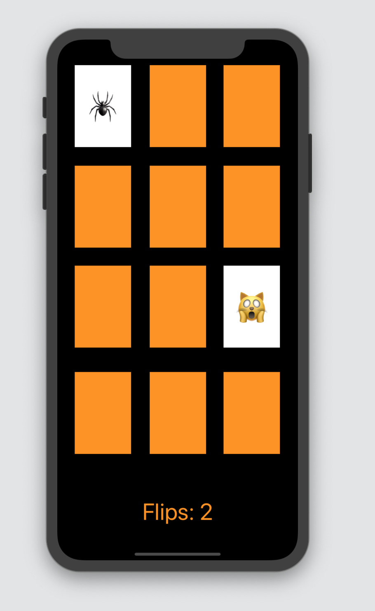

# Concentrate!

 **This app is a simple iOS game designed to test your memory and concentration**
 
## How Can I play? 

**When the game starts you are given a screen with 12 face down cards, as seen below:**

**Tapping on a card will flip it over and increase your score by one**

**If the next card you tap is identical to your card, both cards get removed from the game**

 

**If both cards are different, they get flipped back over and you have to try to remember their location**

**The goal is to finish with the lowest score possible. Once all matching cards are found the game ends**

**This project is based on the online Youtube lectures posted by [Stanford University](https://www.youtube.com/watch?v=TZL5AmwuwlA&list=PL3d_SFOiG7_8ofjyKzX6Nl1wZehbdiZC_&index=1)**
